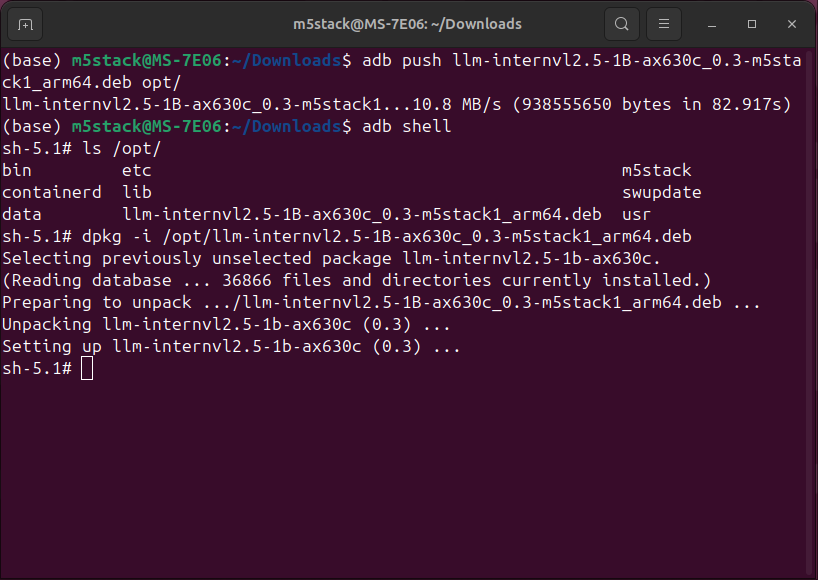
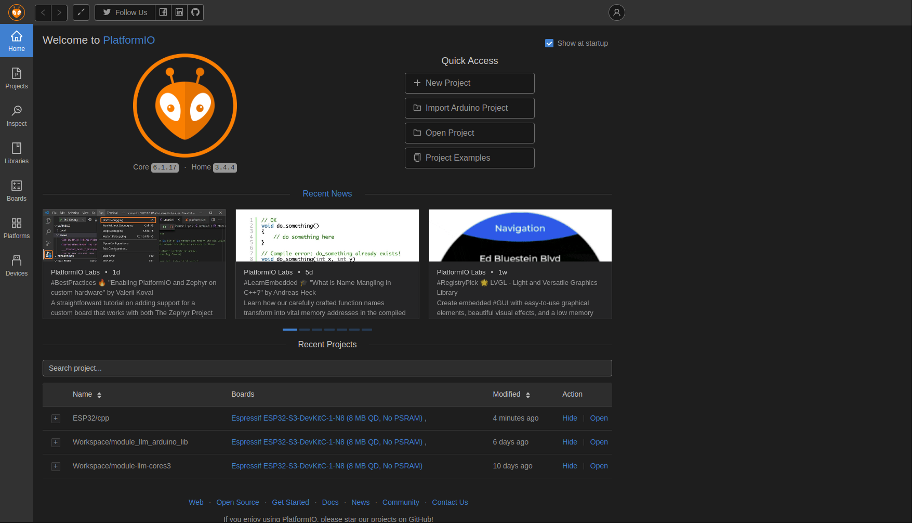
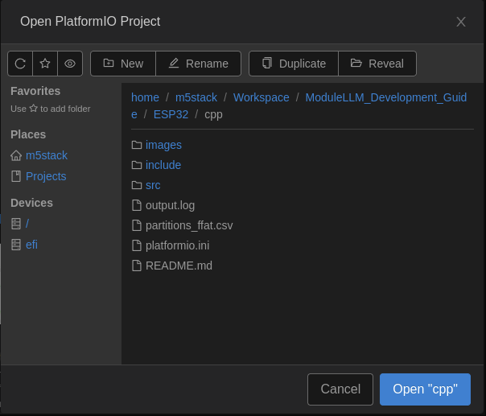
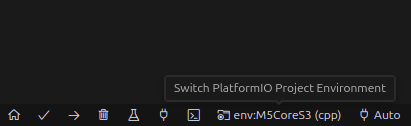

# 如何使用
## Module LLM 部分
### 1. 参考 [Module LLM 固件升级](https://docs.m5stack.com/zh_CN/guide/llm/llm/image)，获取最新的 [Module LLM 底包](https://m5stack.oss-cn-shenzhen.aliyuncs.com/resource/linux/llm/M5_LLM_ubuntu2022-02_20241203-mini.axp) (M5_LLM_ubuntu_v1.3_20241203-mini)
### 2. 使用 Windows 操作系统电脑，参考《**烧录升级**》部分，升级最新的**Module LLM 底包**
### 3. 获取最新的 [Module LLM 软件包](https://github.com/m5stack/StackFlow/releases)，需要自行下载
#### 3.1 用到的 **VLLM 模型**， llm-internvl2.5-1B-ax630c_0.3-m5stack1_arm64.deb [Github](https://github.com/m5stack/StackFlow/releases/download/v1.4.0/llm-internvl2.5-1B-ax630c_0.3-m5stack1_arm64.deb) **|** [ali-oss](https://m5stack.oss-cn-shenzhen.aliyuncs.com/resource/linux/llm/deb/llm-internvl2.5-1B-ax630c_0.3-m5stack1_arm64.deb)
#### 3.2 用到的 **VLM 软件包**，llm-vlm_1.4-m5stack1_arm64.deb [Github](https://github.com/m5stack/StackFlow/releases/download/v1.4.0/lib-llm_1.4-m5stack1_arm64.deb) **|** [ali-oss](https://m5stack.oss-cn-shenzhen.aliyuncs.com/resource/linux/llm/deb/llm-vlm_1.4-m5stack1_arm64.deb)
#### 3.3 用到的 **LIB 包**，lib-llm_1.4-m5stack1_arm64.deb [Github](https://github.com/m5stack/StackFlow/releases/download/v1.4.0/lib-llm_1.4-m5stack1_arm64.deb) **|** [ali-oss](https://m5stack.oss-cn-shenzhen.aliyuncs.com/resource/linux/llm/deb/lib-llm_1.4-m5stack1_arm64.deb)
#### 3.5 用到的 **YOLO 姿态模型** llm-yolo11n-pose_0.3-m5stack1_arm64.deb [Github](https://github.com/m5stack/StackFlow/releases/download/v1.4.0/llm-yolo11n-pose_0.3-m5stack1_arm64.deb) **|** [ali-oss](https://m5stack.oss-cn-shenzhen.aliyuncs.com/resource/linux/llm/deb/llm-yolo11n-pose_0.3-m5stack1_arm64.deb)
#### 3.6 用到的 **YOLO 手部姿态模型** llm-yolo11n-hand-pose_0.3-m5stack1_arm64.deb [Github](https://github.com/m5stack/StackFlow/releases/download/v1.4.0/llm-yolo11n-hand-pose_0.3-m5stack1_arm64.deb) **|** [ali-oss](https://m5stack.oss-cn-shenzhen.aliyuncs.com/resource/linux/llm/deb/llm-yolo11n-hand-pose_0.3-m5stack1_arm64.deb)
#### 3.7 用到的 **YOLO 软件包** llm-yolo_1.4-m5stack1_arm64.deb [Github](https://github.com/m5stack/StackFlow/releases/download/v1.4.0/llm-yolo_1.4-m5stack1_arm64.deb) **|** [ali-oss](https://m5stack.oss-cn-shenzhen.aliyuncs.com/resource/linux/llm/deb/llm-yolo_1.4-m5stack1_arm64.deb)
### 4. 安装需要的软件包 
#### **【方法一】** 参考《**应用升级**》 部分，通过 SD 卡自动安装
#### **【方法二】** 参考 [调试板使用教程](https://docs.m5stack.com/zh_CN/guide/llm/llm/adb) 及以下文档
```bash
adb push llm-internvl2.5-1B-ax630c_0.3-m5stack1_arm64.deb /opt/
adb push llm-vlm_1.4-m5stack1_arm64.deb /opt/
adb push lib-llm_1.4-m5stack1_arm64.deb /opt/
adb push llm-yolo11n-pose_0.3-m5stack1_arm64.deb /opt/
adb push llm-yolo11n-hand-pose_0.3-m5stack1_arm64.deb /opt/
adb push llm-yolo_1.4-m5stack1_arm64.deb /opt/
```
```bash
adb shell
```
```bash
ls /opt/
```
```bash
dpkg -i /opt/llm-internvl2.5-1B-ax630c_0.3-m5stack1_arm64.deb
dpkg -i /opt/llm-vlm_1.4-m5stack1_arm64.deb.deb
dpkg -i /opt/lib-llm_1.4-m5stack1_arm64.deb.deb
dpkg -i /opt/llm-yolo11n-pose_0.3-m5stack1_arm64.deb
dpkg -i /opt/llm-yolo11n-hand-pose_0.3-m5stack1_arm64.deb
dpkg -i /opt/llm-yolo_1.4-m5stack1_arm64.deb
```

### 5. 📢 配置 **Module LLM** 串口波特率，将 ModuleLLM_Development_Guide/ESP32/cpp/sys_config.json 通过 adb 上传到 Module LLM 中并**重启 ModuleLLM**
```bash
cd ESP32/cpp/
```
```bash
adb push sys_config.json /opt/m5stack/
```
⚠️ 注意：如果需要改回默认配置，只需编辑 sys_config.json 将 config_serial_baud 的值改成 115200 覆盖源文件或者删除 Module LLM /opt/m5stack/目录下的此文件

## CoreS3 部分
### 使用 platformio
### 1. 参考 [platformio](https://docs.platformio.org/en/latest/) 文档安装对应平台的 **platformio** 环境

### 2. 打开 Module LLM ESP32 CPP项目

### 3. 选择对应的板子及端口

### 4. 点击 **"✓"** 编译，点击 **"→"** 烧录，如果出现烧录失败，按住 **CoreS3** 重启按键 2s 待绿灯亮起进入下载模式，然后重新烧录